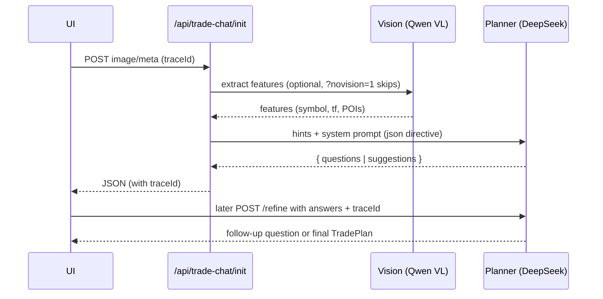
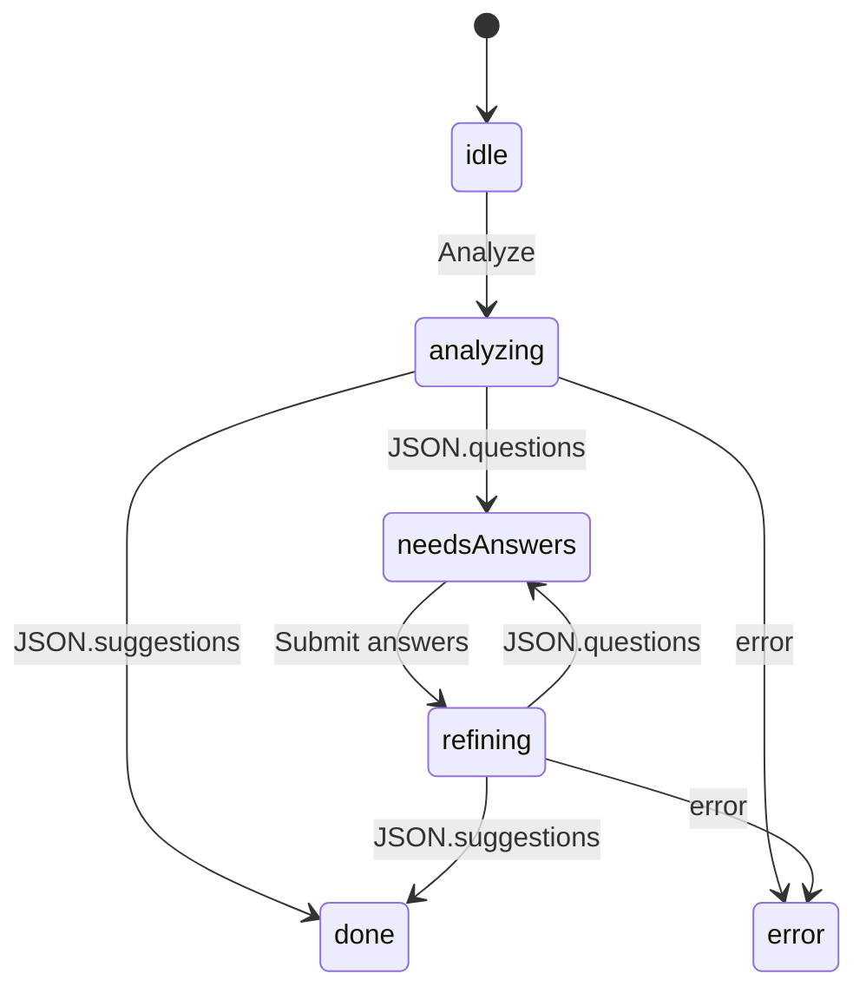

# AI Trade Chat Debug Guide

## Quick Start

1. Set `DEBUG_AI=1` in `.env.local`.
2. Start dev server: `pnpm dev -- --hostname 127.0.0.1 --port 3003` *(adjust port as needed)*.
3. Open `/api/trade-chat/health` and confirm `{ ok: true, vision: { ok: true }, planner: { ok: true } }`.
4. Visit `/chat/dev-demo`, upload a chart (or use `?novision=1` to skip vision), click **Analyze**, then answer with `1% BTCUSDT 15m`.
5. In DevTools network tab you should see `POST /api/trade-chat/refine` returning `200` with a JSON body. The console prints `[REFINE] client start/end ...`.
6. Server logs show:
   - `[INIT] <traceId> planner_start/end ...`
   - `[REFINE] <traceId> accept ...`
   - `[PLANNER START/END] <traceId> ms: ... q: ... s: ...`

## Forcing Text-Only Planner (`?novision=1`)

- Append `?novision=1` to `/chat/dev-demo` to bypass Qwen VL and send the request directly to the planner.
- The init route skips image extraction, keeps the hints you typed, and still hits DeepSeek with the JSON directive.
- Useful for isolating planner problems or when VL usage fails.

## Common DeepSeek Responses & Retries

| Error | Meaning | What we do |
| --- | --- | --- |
| `400` containing `"word 'json'"` | API didn’t spot the json directive | We retry once with an extra directive line |
| `400 model not found` | Invalid model ID | Auto-fallback to `deepseek-chat` |
| Timeout (`AbortError`) | Planner took longer than `PLANNER_TIMEOUT_MS` | UI surfaces friendly timeout, server returns `questions: []` with `planner_error` id |

All planner calls run with `response_format: { type: "json_object" }`, `temperature: 0.2`, `max_output_tokens: 1000`, and elapsed milliseconds are logged alongside the trace id.

## Mermaid Diagrams

### Pipeline

### useTradeAnalysis State Machine

